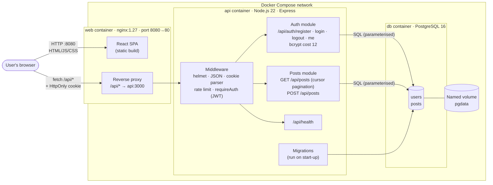
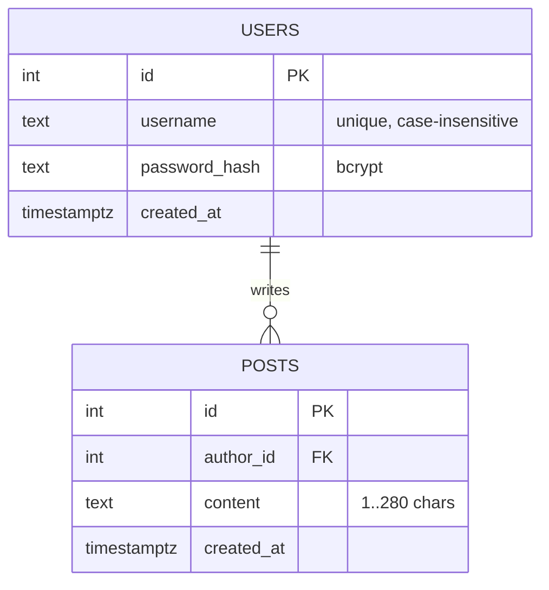
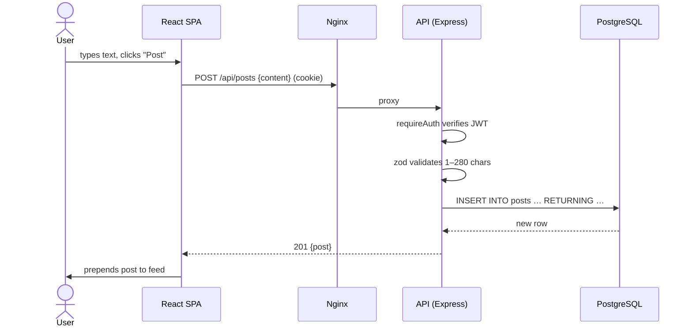

# Architecture

## Style: modular monolith + single-page frontend

Chirp is a **monolithic backend** (one deployable Node.js service containing the auth and posts
modules) behind an **Nginx-served React SPA**, with **PostgreSQL** for persistence. Each runs in its
own container, orchestrated by Docker Compose. The reasoning is recorded in
[ADR-0001](adr/0001-monolithic-architecture.md).

## Diagram

A static PNG export is not needed: GitHub renders the Mermaid diagram above.

## Components

| Component | Technology | Responsibility |
| --------- | ---------- | -------------- |
| `frontend/` | React 18, TypeScript, Vite, React Router | Pages for Sign in, Register, Feed; calls the API with `fetch` and `credentials: 'include'`. |
| `web` container | Nginx | Serves the built SPA, falls back to `index.html` for client routes, proxies `/api` to the API so browser and API share one origin (no CORS). |
| `backend/` | Node.js 22, Express 4, TypeScript | REST API. Modules: `auth` (register/login/logout/me), `posts` (feed/create). Validation with zod. |
| Auth | bcryptjs (cost 12), JSON Web Token in HttpOnly cookie | Stateless sessions (7-day expiry). See [ADR-0002](adr/0002-authentication.md). |
| `db` container | PostgreSQL 16 | Stores users and posts. Data on named volume `pgdata`. See [ADR-0003](adr/0003-postgresql.md). |

## Data model

Index `posts_created_at_id_idx (created_at DESC, id DESC)` backs the newest-first feed and its
keyset (cursor) pagination.

## REST API

| Method | Path | Auth | Body | Success | Errors |
| ------ | ---- | ---- | ---- | ------- | ------ |
| GET | `/api/health` | – | – | 200 `{status:"ok"}` | 503 if DB unreachable |
| POST | `/api/auth/register` | – | `{username, password}` | 201 `{user}` + cookie | 400 validation, 409 taken, 429 |
| POST | `/api/auth/login` | – | `{username, password}` | 200 `{user}` + cookie | 400, 401, 429 |
| POST | `/api/auth/logout` | – | – | 204, cookie cleared | – |
| GET | `/api/auth/me` | ✔ | – | 200 `{user}` | 401 |
| GET | `/api/posts?limit=&cursor=` | ✔ | – | 200 `{posts:[{id,content,createdAt,author:{id,username}}], nextCursor}` | 400, 401 |
| POST | `/api/posts` | ✔ | `{content}` | 201 `{post}` | 400, 401 |

## Request flow: creating a post

